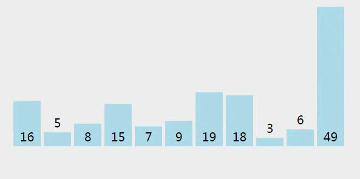

## 原理

冒泡算法是十大排序算法之一，比较常见。其原理是重复地走访要排序的数列，一次比较相邻两个元素，如果元素位置错误，则交换位置，直到没有数据需要交换为止。

冒泡排序中，最大的元素在每一次排序后都会跑到数列右端，就像开水中的水泡网上冒一样，最大的泡先冒出来。

冒泡排序也叫下沉排序，此时是将小的元素往右移，即每趟排序都将数组内的最小元素移到数组最左端。

## 步骤

1. 遍历数组，比较相邻两个元素，如果第一个大于第二个，则交换位置；
2. 对每一对相邻的元素做同样的动作，从开始第一对到最后一对，完成后，最大的元素将跑到数组的最右端，完成第一趟排序；
3. 对所有元素重复上面的步骤，除了最后一个；
4. 重复上面的步骤，每次排序的元素将越来越少，直到没有元素需要比较为止。

## 图解



## 实现

冒泡排序使用Python实现如下:

```python
def bubble_sort(array):
    length = len(array)
    for index in range(length):
        for i in range(1, length-index):
            if array[i-1] > array[i]:
                array[i-1], array[i] = array[i], array[i - 1]
    return array


l = [16, 5, 8, 15, 7, 9, 19, 18, 3, 6, 49]
print(bubble_sort(l))
```

对于上面的代码，如果要排序的数组本身是有序的，也会老老实实的跑完n趟（n为数组中元素个数），但是这种情况下，是不必要的，因此可加一个标志，如果已经是有序的，即没有元素交换，则结束排序过程：

```python
def bubble_sort(array):
    length = len(array)
    for index in range(length):
        flag = True
        for i in range(1, length-index):
            if array[i-1] > array[i]:
                array[i-1], array[i] = array[i], array[i - 1]
                flag = False
        if flag:
            return array
    return array


l = [16, 5, 8, 15, 7, 9, 19, 18, 3, 6, 49]
print(bubble_sort(l))
```

